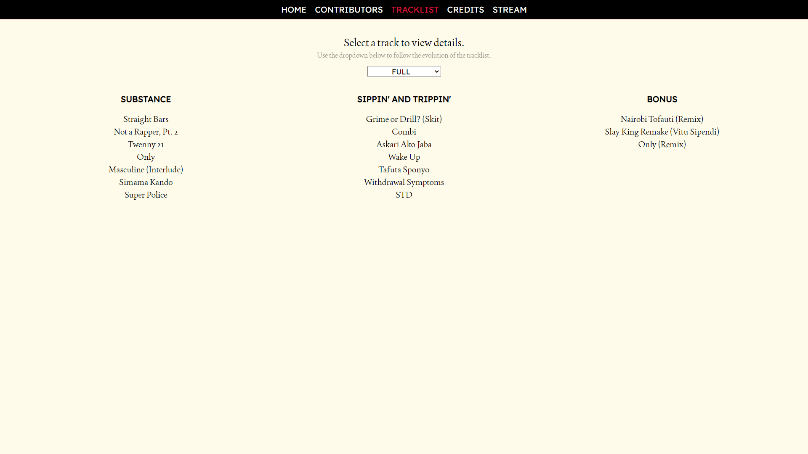
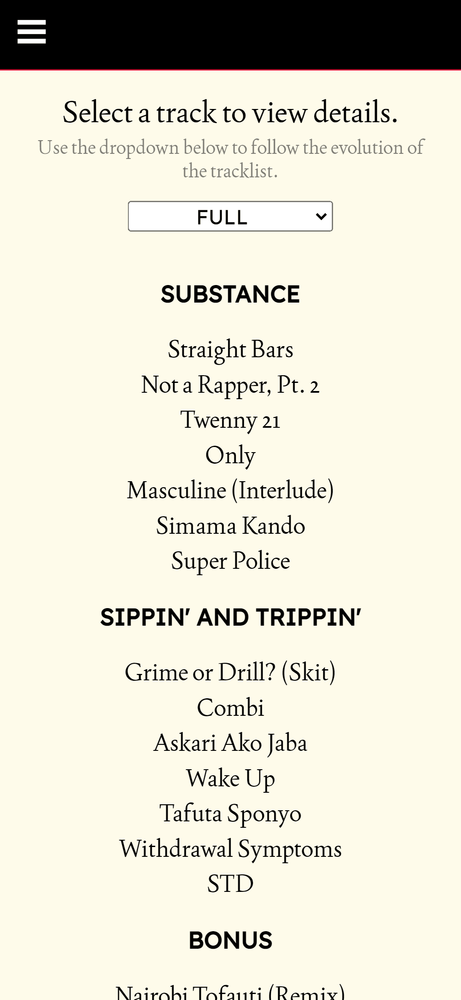

# Man of Substance

*Man of Substance* is my debut studio album as DVK. To accompany the album, I created this app allowing the user to view the synopsis, lyrics and credits for each track, as well as the album's credits and other content added periodically. Prior to the production of the album, I ran a crowdfunding campaign that yielded part of the funds used for it, and contributors are also able to claim their rewards on the app.

## Links
- Repository: [github.com/DavyK17/man-of-substance](https://github.com/DavyK17/man-of-substance)
- Live link: [man-of-substance.pages.dev](https://mos.davykamanzi.com)

## How it was built
### Base libraries/techonolgies
- [SvelteKit](https://kit.svelte.dev/) - Full-stack web application framework
- [Supabase](https://supabase.com/) - Open source backend-as-a-service (BaaS)
- [TypeScript](https://www.typescriptlang.org/) - Typed JavaScript programming language

#### Testing and monitoring

- [Playwright](https://playwright.dev/) - End-to-end testing framework
- [Vitest](https://vitest.dev/) - Unit testing framework

### Supporting libraries/technologies
- [JS File Downloader](https://github.com/AleeeKoi/js-file-downloader) - JavaScript library for downloading files on the browser
- [JSZip](https://stuk.github.io/jszip/) - JavaScript library for creating, reading, and editing .zip files
- [Moment.js](https://momentjs.com/) - JavaScript time manipulation library

## Features
The *Man of Substance* website is a single page app (SPA) with a simple design that is accessible from desktop, tablet and mobile devices with all modern browsers, with Lighthouse scores of 74 for performance, 100 for accessibility, 92 for best practices, and 100 for SEO (full report can be viewed by [clicking here](./readme/lighthouse.pdf)).

Prior to the album's release, each page on the site displayed certain messages showing that content was locked, depending on the content requested (these can be revisited in detail by looking at the app's tests). 

### Contributors
The Contributors page communicates with the [backend](https://github.com/DavyK17/man-of-substance-server) via a REST API to display a list of all contributors present in the app's database. Contributors are able to log in using their email address, which gives them access to a simple dashboard that allows them to view and claim their rewards, depending on the tier they belong to. Rewards including track downloads, personalised "thank you" videos and more.

Downloadable files are stored and served using [Supabase Storage](https://supabase.com/docs/guides/storage), allowing contributors to retrieve their rewards from the app's bucket.

### Tracklist, tracks and credits
The app instantly loads all track and credits data from a JSON file, rather than from the app's databse in order to optimise loading times.

## Wireframes
### Home page

### Contributors page

### Tracklist page

### Track page

## Screenshots
### Desktop version
#### Home page

#### Contributors page

#### Tracklist page

#### Track page

#### Credits page

### Mobile version
#### Home page

#### Contributors page

#### Tracklist page

#### Track page

#### Credits page

## Future work
Looking to potentially keep my listeners engaged with periodic content on the app, such as secret challenges.

## Author
- GitHub: [@DavyK17](https://github.com/DavyK17)
- Website: [davyk17.pages.dev](https://davyk17.pages.dev)
